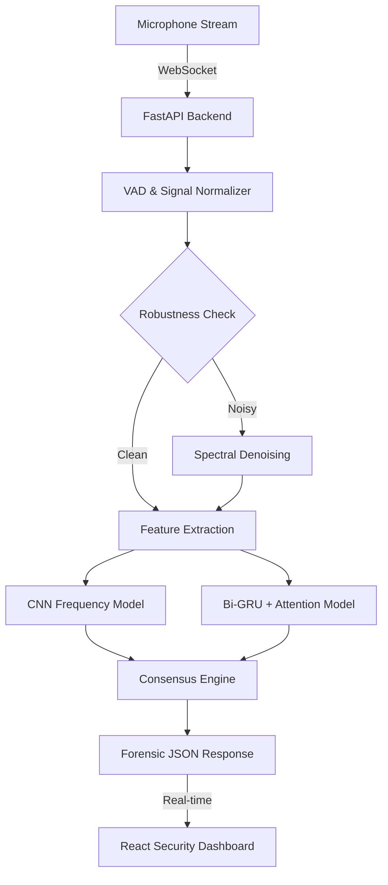

# LG — LiveGuard Voice Shield 🛡️🎙️
> **Real-time Deepfake Detection & Forensic Signal Intelligence**

LiveGuard is a high-performance, low-latency system designed to detect AI-generated voice clones in real-world scenarios. Built for the **Code Unnati Marathon 4.0**, it features an advanced multi-model consensus engine with explainable AI (XAI) outputs.

---

## 🚀 Key Highlights

*   **98.83% Accuracy**: Verified performance using an Attention-based Bidirectional GRU for temporal rhythm analysis.
*   **Dual-Model Consensus**: Votes between **CNN** (Spectral Patterns) and **Bi-GRU + Attention** (Temporal Rhythm) to virtually eliminate false positives.
*   **Forensic Explainability**: Identifies exactly which frequency bands show synthetic artifacts.
*   **Source Attribution**: Fingerprints the DNA of generators like **ElevenLabs**, **RVC**, and **Bark**.
*   **Adversarial Defense**: Real-time SNR monitoring and **Spectral Denoising** for usage in noisy environments.
*   **Forensic Audit Log**: A persistent record of malicious activity detections for security investigations.

---

## 🛠️ Technical Architecture

---

## 🏗️ Getting Started

### Prerequisites

*   Python 3.9+
*   Node.js 18+ (npm)

### Step 1: Backend Setup
1. `cd backend`
2. `pip install -r requirements.txt`
3. `python -m backend.main`
   * *Server will run on http://127.0.0.1:8000*

### Step 2: Frontend Setup
1. `cd frontend`
2. `npm install`
3. `npm run dev`
   * *Dashboard will be available at http://localhost:5173*

---

## 🎙️ Demo Guide

1. Click **"Start Live Scan"** on the dashboard.
2. **Normal Speech**: System identifies as "Human" with <5% Risk.
3. **AI Sample**: Play a synthetic voice file or use a voice changer.
4. **Analysis**:
   * Watch the **Risk Gauge** spike.
   * Observe the **Frequency Fingerprinting** card for XAI insights.
   * View the **Forensic Audit Log** at the bottom for the high-confidence event.

---
**Code Unnati Marathon 4.0 Submission** 🏁
🛡️ Built with Precision | 🔬 Powered by Attention
